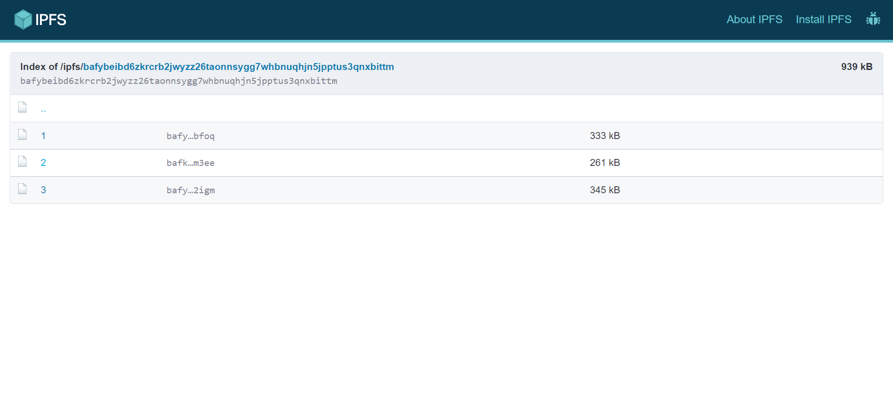

# FilDrop

Backup your images to IPFS storage and convert them into NFTs.


## Clone this repo

```bash
git clone https://github.com/meta-ps/FilDrop/
```

## Run

Make sure you have `python` and `Django` install then run

```python
python manage.py makemigrations
python manage.py migrate
python manage.py runserver
```

## UI

### Home Page


### Dashboard


#### IPFS


